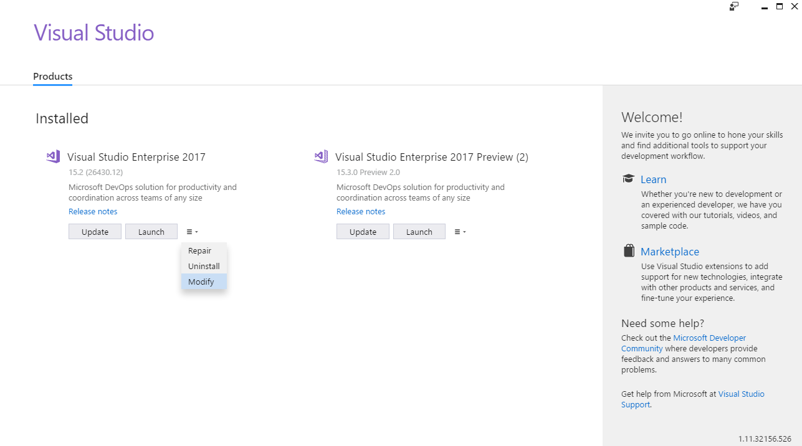
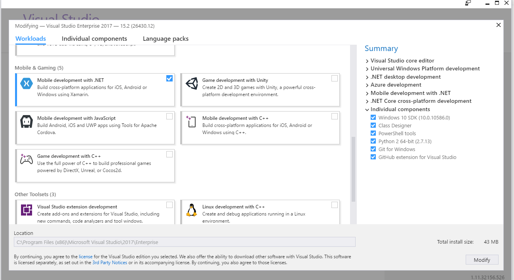

# Bing Web Search And Computer Vision API Tutorial: 
This tutorial explores the Azure Computer Vision and Bing Web Search API endpoints, and how can be used to build a basic visual search application in Xamarin.Forms.  Overall, this tutorial covers the following topics: 
* Setting up your system for Xamarin.Forms development
* Using the Xamarin Media Plugin to capture and import image data in a Xamarin.Forms application
* Formatting images and parsing text from them using the Azure Computer Vision APIs
* Structuring and sending text-based requests to the Bing Web Search API
* Parsing responses from the Bing Web Search and Computer Vision APIs with the NewtonSoft JSON parser (with LINQ and model object deserialization)
* Integrating these APIs into a C# based Xamarin.Forms application 

## Prerequisites
### Platform Requirements
This example was developed in Xamarin.Forms using [Visual Studio 2017 Enterprise Edition](https://www.visualstudio.com/downloads/).  This guide covers the basics of setting up and developing with Xamarin in Visual Studio.  For more information, you can consult the [Xamarin documentation](https://developer.xamarin.com/guides/cross-platform/getting_started/)  on the subject.

### Azure Services
This application utilizes resources from the [Bing Web Search API](https://azure.microsoft.com/en-us/services/cognitive-services/bing-web-search-api/) and the Cognitive Services [Computer Vision API](https://azure.microsoft.com/en-us/services/cognitive-services/computer-vision/).  For a 30-day trial key, see [this page](https://azure.microsoft.com/en-us/try/cognitive-services/), and for more information about attaining keys for yourself, see [Pricing](http://www.google.com).

### Legal:
#### Web Search API:
Use of the Bing Web Search API requires adherence to the Bing Web Search [Use and Display Requirements](https://docs.microsoft.com/en-us/azure/cognitive-services/Bing-Web-Search/UseAndDisplayRequirements).  
**Computer Vision API**: Microsoft receives the images that you upload to the Computer Vision APIs and may use them to improve their systems.  By submitting an image, you confirm that you have followed our [Developer Code of Conduct](https://azure.microsoft.com/en-us/support/legal/developer-code-of-conduct/).  
**Licensing**: XamFormsVisualSearch is an open source application registered under the [MIT Open Source License](https://microsoft.mit-license.org/).  You can use as a reference or template when building own applications utilizing the Microsoft Computer Vision and Web Search APIs. 

## Environment Setup  
### Installing Xamarin  
With Visual Studio 2017 installed, open the Visual Studio Installer, select the hamburger menu associated with your Visual Studio installation, and select "Modify."
 

Now, scroll down to Mobile & Gaming, and make sure that you've enabled "Mobile Development with .NET"

Now, click "Modify" in the bottom right corner of the window, and wait for Xamarin to install.

## Building and running the sample app
### Step 0: Download the sample
The sample can be found at [XamFormsVisualSearch](https://github.com/Azure-Samples/XamFormsVisualSearch). You can download it using Visual Studio or directly from GitHub.

### Step 1: Install the sample
In Visual Studio, open *XamFormsVisualSearch\VisualSearchApp.sln*.  It may take a few moments to initialize all of the required components. 

### Step 2: Build the sample
Press **Ctrl+Shift+B**, or click **Build** on the ribbon menu, then select **Build Solution**.  This builds the solution for all available platforms.  If you wish to compile and test code for iOS while using a windows machine, you can reference [this guide](https://developer.xamarin.com/guides/ios/getting_started/installation/windows/") for help.

### Step 3: Configure your deployment
Before running the application, you need to select a target Configuration, Platform, and Project.  Xamarin.Forms applications compile to native code for Windows, Android, and iOS.  This guide includes screenshots from the Windows compilation of the codebase.  However, all compilations are functionally equivalent.  

### Step 4: Run the app
1) After the build is complete and your target platform is selected, click the **Start** button in the toolbar or press **F5**.  This deploys your solution to your target platform.  
2) The application should open to the following page (defined in code as *AddKeysPage.xaml*).    From here, you can input your Azure Computer Vision and Bing Web Search API keys.  If you would like to skip this page in later compilations, you can manually add your keys in the *App.xaml.cs* page of the codebase. 

3) Adding a set of working Azure keys takes you to the following page (defined in code as the OcrSelectPage).    From here, you can either import or capture a new photo and then pass that photo to the Print or Handwritten OCR service for processing. 

Please note that the Handwritten OCR endpoint is in preview, and although functional at the time of this guide's writing, its outputs and funtionality are subject to change.  Additionally, Microsoft receives the images that you upload and may use them to improve the Computer Vision API and related services.  By submitting an image, you confirm that you have followed our Developer Code of Conduct.  

## Review and Learn:
Now that we have a functioning application, let's jump in and explore exactly how it utilizes resources from the Microsoft Cognitive Services toolkit.  Whether you're using this sample as a starting point for your own application or simply as a reference for the Cognitive Services APIs, it will be valuable to walk through the application screen by screen and examine exactly how it works.

### Required Libraries:  
This app makes use of the libraries below.  The first two can be installed using the NuGet Package manager, while the third can be found in the reference guide linked below.
* [Xamarin Media Plugin](https://blog.xamarin.com/getting-started-with-the-media-plugin-for-xamarin/)
* [Newtonsoft JSON parser](http://www.newtonsoft.com/json)
* [Xamarin Forms Samples Image Resizer](https://github.com/xamarin/xamarin-forms-samples/tree/master/XamFormsImageResize)

### Key Entry Page
#### UI
The first page that a user will see when they enter the app will be the key entry page shown here.  Its UI is defined in *AddKeysPage.xaml*, and most of the logic controlling that UI is defined in *AddKeysPage.xaml.cs*.  
The UI for this page is relatively simple; it is a Xamarin.Forms StackedLayout containing elements for the two text input boxes and the Add Keys button, which calls the *TryToAddKeys* method in *AddKeysPage.xaml.cs*. 
#### Backing Logic:
*AddKeysPage.xaml.cs* sends test calls to each of the utilized Azure Cognitive Services endpoints to check the user-defined keys and to ensure their functionality.  This is done in the functions *CheckComputerVisionKey* and *CheckBingSearchKey*  Although we will go over the specifics of how to optimally structure these calls later, this is a great place to start examining exactly how to hit the cognitive services endpoints and unpack their responses.  

First I establish the root

    public partial class AddKeysPage : ContentPage
	{
        // booleans set when the keys are proven to work
        private bool computerVisionKeyWorks = false;
        private bool bingSearchKeyWorks = false;

        // URIs of the endpoints used in the test requests
        private string ocrUri = "https://westcentralus.api.cognitive.microsoft.com/vision/v1.0/ocr?";
        private string searchUri = "https://api.cognitive.microsoft.com/bing/v5.0/search?";

        public AddKeysPage ()
		{
			InitializeComponent();
		}

        // send a test POST request to see if the Vision API Key is functional
        async Task CheckComputerVisionKey(object sender = null, EventArgs e = null)
        {
            HttpResponseMessage response;
            byte[] emptyImage = new byte[10];
            HttpClient VisionApiClient = new HttpClient();

            VisionApiClient.DefaultRequestHeaders.Add("Ocp-Apim-Subscription-Key", ComputerVisionKeyEntry.Text);
            using (var content = new ByteArrayContent(emptyImage))
            {
                // The media type of the body sent to the API. "application/octet-stream" defines an image represented as a byte array
                content.Headers.ContentType = new MediaTypeHeaderValue("application/octet-stream");
                response = await VisionApiClient.PostAsync(ocrUri, content);
            }
            if ((int)response.StatusCode != 401)
            {
                ComputerVisionKeyEntry.BackgroundColor = Color.Green;
                ApiKeys.computerVisionKey = ComputerVisionKeyEntry.Text;
                computerVisionKeyWorks = true;
            }
            else
            {
                ComputerVisionKeyEntry.BackgroundColor = Color.Red;
                computerVisionKeyWorks = false;
            }
        }

        // send a test GET request to see if the Bing Search API key is functional
        async Task CheckBingSearchKey(object sender = null, EventArgs e = null)
        {
            searchUri += "q=test" 
            HttpClient SearchApiClient = new HttpClient();
            SearchApiClient.DefaultRequestHeaders.Add("Ocp-Apim-Subscription-Key", BingSearchKeyEntry.Text);
            HttpResponseMessage response = await SearchApiClient.GetAsync(searchUri);
            if ((int)response.StatusCode != 401)
            {
                BingSearchKeyEntry.BackgroundColor = Color.Green;
                ApiKeys.bingSearchKey = BingSearchKeyEntry.Text;
                bingSearchKeyWorks = true;
            }
            else
            {
                BingSearchKeyEntry.BackgroundColor = Color.Red;
                bingSearchKeyWorks = false;
            }
        }

        async void TryToAddKeys(object sender, EventArgs e)
        {
            if (!computerVisionKeyWorks)
                await CheckComputerVisionKey();
            if (!bingSearchKeyWorks)
                await CheckBingSearchKey();

            if (bingSearchKeyWorks && computerVisionKeyWorks)
            {
                await Navigation.PopModalAsync();
            }
            else
            {
                await DisplayAlert("Error","One or more of your keys are invalid.  Please update them and try again", "OK");
            }
        }
    }

### OcrSelectPage:

**Description of the OcrSelectPage**
* Is a Xamarin Forms TabbedPage where users can import or take photos for processing, and can decide what form of OCR to perform.
* (Maybe or not?) discuss how objects set to the buttons so that you can track the calling button.
* Explain the Xamarin Media Plugin, & link to docs.
    * Found @ <https://components.xamarin.com/view/mediaplugin> 

### OcrResultsPage

**Description of OcrResultsPage**
* Is a Xamarin Forms ContentPage, which contains a listview presenting all of the words extracted from a given image
* Walk through the use of each of the two different APIs, highlighting how one gives a direct response where the other returns an endpoint that must be queried later.  
    * General Description: <https://azure.microsoft.com/en-us/services/cognitive-services/computer-vision/>
    * Api Reference <https://westus.dev.cognitive.microsoft.com/docs/services/56f91f2d778daf23d8ec6739/operations/56f91f2e778daf14a499e1fa>
    * QuickStarts for API use: <https://docs.microsoft.com/en-us/azure/cognitive-services/computer-vision/quickstarts/csharp>
* Comment on the use of SelectTokens to find content, and link to the NewtonSoft Docs.  
    * Found @ <http://www.newtonsoft.com/json/help/html/SelectToken.htm>
    * Note that later, an alternative object deserializing method will be used to obtain a richer set of data per object

### WebResultsPage

**Description of WebResultsPage**
* Is a Xamarin.Forms ContentPage, which contains a listview presenting all of the words extracted from a given image
* Uses the Web Search API:
    * General descripton: <https://azure.microsoft.com/en-us/services/cognitive-services/bing-web-search-api/>
    * API Reference: <https://docs.microsoft.com/en-us/rest/api/cognitiveservices/bing-web-api-v5-reference>
    * Page ranking tutorial: <https://docs.microsoft.com/en-us/azure/cognitive-services/bing-web-search/csharp-ranking-tutorial> 

### Opening a Webview

**Example of opening a webview**

**Commentary on other things that could be done with the same content**
* Comment that you could swap out standard for Bing Custom Search
* Highlight that the same structure could be applied to the Bing Image Search "Image Insights" section for reverse image lookup and simple object recognition
