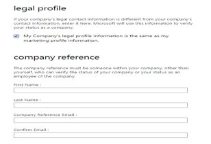

<properties
   pageTitle="Creating and Registering Publisher Account Process"
   description="Detailed steps of creating an MSA account, establishing a seller profile, and registering as an Azure publisher."
   services="Azure Marketplace"
   documentationCenter=""
   authors="HannibalSII"
   manager=""
   editor=""/>

<tags
   ms.service="AzureStore"
   ms.devlang="en-us"
   ms.topic="Seller Account Creation and Registration"
   ms.tgt_pltfrm="Azure"
   ms.workload=""
   ms.date="09/09/2015"
   ms.author="hascipio"/>

# Publisher Account Creation & Registration Process
## Create a Microsoft Account
> Important: In order to complete the publishing process, you will need to create a Microsoft account. This account will be used to register for and to log in to both the Publishing Portal and the Seller Dashboard. You should only have one Microsoft Account for your Azure Marketplace offerings. They should not be specific to individual VMs.

The address that forms the user name should be on your domain and controlled by your IT team (such as azurepublishing@yourcompany.com). Payment, tax information, and reporting will be routed through this account.

1. Create a Distribution List (DL) or Security Group (SG) within your company's domain.
  - Add your onboarding team to the DL
  - DL must be live to receive confirmation email
  - This needs to be completed in your internal systems.For e.g. AzureStore@yourcompany.com
2. Open a new Chrome Incognito or IE InPrivate browsing session to ensure that you’re not logged into an existing account
3. Register for your a Microsoft Account (MSA) using the Distribution List Email.
 - You can register for a MSA at https://signup.live.com/signup.aspx
 - Use AzureStore@yourcompany.com as the email address
 - Your MSA ID is now AzureStore@yourcompany.com

    

4. When registering, use a valid phone number. The system will send a verification code as a text message or an automated call if identify verification is required.
5. Verify the email address sent to the DL

  

6. You’re now ready to use the new MSA in the Seller Dashboard.
>**NOTE**: Using the DL allows multiple people to receive email notifications that are important reporting of payout information, and also insures that ownership of the MSA can be transferred and isn’t tied to a single individual.

## Create your Seller Dashboard account
The Microsoft Seller Dashboard is used to register the company information once. The registrant must be a valid representative of the company, and must provide their personal information as a way to validate their identity. The person registering must use a Microsoft account (MSA) that is shared for the company, and the same account must be used in the Azure Publishing Portal. You should check to make sure your company does not already have a Seller Dashboard account before attempting to create one. During the process, we will collect bank account information, tax information, and company address information. These are typically obtainable from finance or business contacts. For complete instructions on how to create a Seller Dashboard account, see [Create Your Account and Add Payout Information in the Microsoft][link-msdndoc].

1. Open a new  IE InPrivate or Chrome Incognito browsing session to ensure that you’re not logged into a personal account

2. Go to http://sellerdashboard.microsoft.com

  

3. Sign in with your company registration Microsoft Account (MSA) (i.e. AzureStore@yourcompany.com)

  

4. Complete the "Help us protect your account" wizard, which will verify your identity via phone number or email address.

  

5. Go to Account Details. On this screen, you will enter your PERSONAL information, which is only used for identity verification. That means your name, email address, residential address, and personal phone number. This information is not shared with anyone outside of Microsoft.

  

  

6. Register on behalf of your company by designating your account type as Company, NOT Individual. Click Next.

  

7. Fill in the Company details. This needs to be accurate information – headquarters, reference, will all be checked by a team at Microsoft.

  

8. Company name in below details is used by publisher portal hence should be accurate

      
9. Use the address of your company head quarters

      
10. Use reference that will be accessible & recognizable as a company representative

      
11. Click Submit for Approval and you are done.

      

<!--
8. You must provide payout and tax information and submit it for validation. In order to add payout and tax information, go to Account > Payout & Tax and click Add. Enter your company's information. You will be required to provide a Tax Identification Number and other tax information matching the country in which your business is headquartered.
-->
Once you register your company, you can continue working in parallel while the verification of your registration is completed by the Seller Dashboard team. You can monitor the status of your approvals via the [Azure Publishing Portal][link-pubportal].

## Register your account in the Publishing Portal
The Azure Publishing Portal is used to publish and manage your offer(s). Think of it as the CMS for your offerings/artifacts. All remaining work is completed here.

> Important: The same company Microsoft Account that was used in the Seller Dashboard registration MUST be used here. Additional users can be added to assist once the master publisher account has been created.

1.	Open a new Chrome Incognito or IE InPrivate browsing session to ensure that you’re not logged into a personal account
2.	Go to http://publish.windowsazure.com
3.	 Sign in with your company registration Microsoft Account (MSA) (i.e. AzureStore@yourcompany.com)
4.	Read & agree to the terms of the publishing portal and you are done here.*

## Next Steps
Now that your account is created and registered, click on the type of artifact (virtual machine, developer service, data service, solution template) that you would like to publish to the Azure Marketplace. Visit one of the following articles to learn how to publish your respective offer:
 - [Publish a virtual machine][0]
 - [Publish a developer service][0]
 - [Publish a data service][0]
 - [Publish a solution template][0]

[0]: http://.
[link-msdndoc]: https://msdn.microsoft.com/en-us/library/jj552460.aspx
[link-sellerdashboard]: http://sellerdashboard.microsoft.com/
[link-pubportal]: https://publish.windowsazure.com
