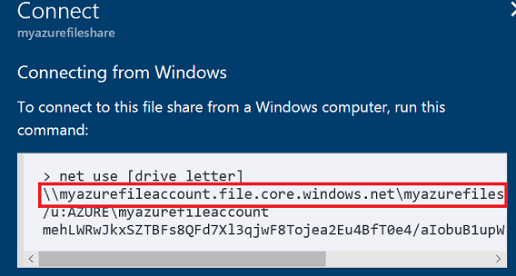

# Mount the file share from a machine running macOS
Azure File storage is a service that offers file shares in the cloud using the standard Server Message Block (SMB) Protocol. Both SMB 2.1 and SMB 3.0 are supported. 

On macOS, mounting is possible from the machines located at local datacenter or on-premises provided the [prereqisites](#prereq) below are met. UI mounting differs slightly in each OS. We will go over mounting Azure File Share form El Capitan UI.


* [Prerequisites](#prereq)
* [Mount Azure File Share using File Explorer on El Capitan](#elcapitan)
* [Mount Azure file share using sudo mount command](#sudomount)
* [Mount file share using command line on El Capitan](#sudomount)
* [Troubleshooting  Azure file share issues on macOS](#tsg)


## Prerequisites for mounting Azure File on macOS

### Azure File Share URL
In the portal, find the URL to the share in the Connect pane – just the
    \\\\computer\\share part.


### Storage Account Key
You will need access to your subscription in Azure Portal or your primary or secondary storage account name and key. SAS key is not supported for mounting.

### Open SMB over TCP port 445
If you are connecting to a Azure FIle Share, check to see if your firewall is not blocking TCP ports 445 from client machine.

### Operating support for SMB 2.1 or 3.0
SMB 3.0 is supported starting macOS Sierra. There are known bugs affecting macOS performance over SMB.

<a id="elcapitan"/></a>
## Mount Azure File Share using File Explorer on El Capitan

* Open finder, and in the Go menu, click Connect to Server… in it, you’re going to
    type “smb://” and reverse the direction of your slashes from backslashes
    (windows) to forward slashes (all other sane systems) like the following:

    


* When you click connect, you will be prompted for the username (which is
    autopopulated with your Mac logged on username) and password. Here you enter
    the fileshare name and the storage account key
    will be your password. You will have the option of placing the
    username/password in your keychain. Then you have it mounted. You can start using the file share and drag and drop will works fine.

    


<a id="sudomount"/></a>
## Mount file share using command line on El Capitan

* **Step 1**: [Turn off packet signing for SMB 2 and SMB 3 connections](https://support.apple.com/en-us/HT205926)

```
sudo -s
echo "[default]" >> /etc/nsmb.conf
echo "signing_required=no" >> /etc/nsmb.conf
exit
```
* **Step 2**: Replace \<storage-account-name\> with the name of your storage
account. Provide Storage Account Key as password when prompted. 

```
mount_smbfs //<storage-account-name\>@<storage-account-name\>.file.core.windows.net/sharename [mount point] -o vers=3.0
```

* **Step 3**: 
Browse the Azure File Share using mountpoint.
    

<a id="tsg"/></a>
## Troubleshooting  Azure file share issues on macOS

* **Q.** Azure File Storage is very slow on macOS
    When you use an SMB 2 or SMB 3 connection, packet signing is turned on by default. You might want to turn off packet signing if:
    Performance decreases when you connect to a third-party server.

    Follow the instructions to [turn off packet signing for SMB 2 and SMB 3 connections](https://support.apple.com/en-us/HT205926) published by Apple Support.
    

## Also See

See these links for more information about Azure File storage.

* [Apple Support Article - How to connect with File Sharing on your Mac](https://support.apple.com/en-us/HT204445)
* [FAQ](storage-files-faq.md)
* [Troubleshooting](storage-troubleshoot-file-connection-problems.md)

### Conceptual articles and videos
* [Azure Files Storage: a frictionless cloud SMB file system for Windows and Linux](https://azure.microsoft.com/documentation/videos/azurecon-2015-azure-files-storage-a-frictionless-cloud-smb-file-system-for-windows-and-linux/)
* [How to use Azure File Storage with Linux](storage-how-to-use-files-linux.md)

### Tooling support for File storage
* [Using Azure PowerShell with Azure Storage](storage-powershell-guide-full.md)
* [How to use AzCopy with Microsoft Azure Storage](storage-use-azcopy.md)
* [Using the Azure CLI with Azure Storage](storage-azure-cli.md#create-and-manage-file-shares)
* [Troubleshooting Azure File storage problems](https://docs.microsoft.com/en-us/azure/storage/storage-troubleshoot-file-connection-problems)

### Blog posts
* [Azure File storage is now generally available](https://azure.microsoft.com/blog/azure-file-storage-now-generally-available/)
* [Inside Azure File Storage](https://azure.microsoft.com/blog/inside-azure-file-storage/)
* [Introducing Microsoft Azure File Service](http://blogs.msdn.com/b/windowsazurestorage/archive/2014/05/12/introducing-microsoft-azure-file-service.aspx)
* [Migrating data to Azure File ](https://azure.microsoft.com/en-us/blog/migrating-data-to-microsoft-azure-files/)

### Reference
* [Storage Client Library for .NET reference](https://msdn.microsoft.com/library/azure/dn261237.aspx)
* [File Service REST API reference](http://msdn.microsoft.com/library/azure/dn167006.aspx)
